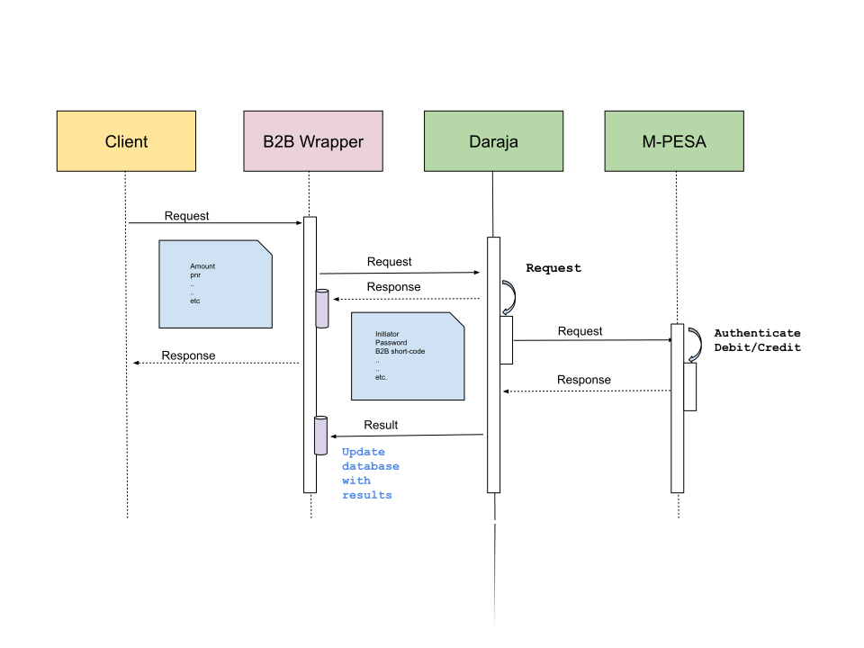

# MPESA B2B API (wrapper)

[](https://github.com/clovisphere/mpesa-b2b-wrapper/actions/workflows/pytest.yml)
[](https://coveralls.io/github/clovisphere/mpesa-b2b-wrapper)

A wrapper that makes it easy to integrate with the [MPESA B2B API](https://developer.safaricom.co.ke/Documentation).



The below endpoints are available:

```bash
[POST] api/v1.0/payment/initiate                      ✅
[POST] api/v1.0/payment/timeout                       ✅
[POST] api/v1.0/payment/confirm                       ✅
````

☝🏽 See [requests.http](requests.http) for sample requests + payloads.

<u>TODO</u>:

- [x] Unit tests
- [x] Logging
- [x] CI/CD
- [x] Dockerize
- [x] Deployment (or how-to section on how to deploy or run the app in production)

## Usage

Make a copy of [.env.dev](.env.dev) file named `.env`, and make sure all the **ENVIRONMENT_VARIABLES** are set.

```bash
$ cp .env.dev .env  # make a copy of .env.dev called .env
```

### (1) Development

Prerequisites:

- [Python](https://www.python.org/downloads/release/python-3112/)
- [Pipenv](https://pipenv.pypa.io/en/latest/)
- [SQLite](https://www.sqlite.org/index.html)

With [Docker](https://www.docker.com/):

Make sure you have both [docker](https://www.docker.com/) and 
[docker-compose](https://docs.docker.com/compose/) installed locally.

```bash
$ docker-compose -f .devops/docker-compose.yml up --build
````

☝🏽The app should be available on [http://127.0.0.1](http://127.0.0.1)

Without [Docker](https://www.docker.com/):

```bash
$ git clone git@github.com:clovisphere/mpesa-b2b-wrapper.git  # clone the repo
$ cd mpesa-b2b-wrapper  # cd into project root
$ export FLASK_ENV=development  # enable development mode
$ export SECRET_KEY=$(python -c "import secrets;print(secrets.token_urlsafe(16))") # generate a secret key
$ pipenv install # install dependencies
$ pipenv shell  # activate virtualenv
$ flask db upgrade  # run migrations
$ flask run --debug  # run the app in debug mode
```

If you need any help with migration, please refer to [Flask-Migrate](https://flask-migrate.readthedocs.io/en/latest/).

To run unittest,

```bash
$ pipenv install --dev  # install dev dependencies
$ coverage run -m pytest  # run tests
$ coverage report -m  # generate coverage report
```

If all went well, your app should be available on [http://127.0.0.1:5000](http://127.0.0.1:5000)


### (2) Production

Prerequisites:

- [Nginx](https://www.nginx.com/)
- [Python](https://www.python.org/downloads/release/python-3112/)
- [Node.js](https://nodejs.org/en/)
- [MySQL](https://www.mysql.com/) or [PostgreSQL](https://www.postgresql.org/)

You may follow [this guide](https://www.digitalocean.com/community/tutorials/how-to-serve-flask-applications-with-gunicorn-and-nginx-on-ubuntu-18-04) to set up your server.


```bash
$ cd /var/www
$ git clone git@github.com:clovisphere/mpesa-b2b-wrapper.git
$ sudo chown -R $USER:www-data /var/www/mpesa-b2b-wrapper
$ sudo chmod -R 755 /var/www/mpesa-b2b-wrapper
```

<u>IMPORTANT</u>:

1. You need to create a **.env** file in the project root, and copy all the **ENVIRONMENT_VARIABLES** in [.env.dev](./.env.dev) to it.
2. Make sure to add your **PUBLIC KEY** in [config/cert](config/cert), the name of the key is to be specified in the **.env** file as **SSL_CERT**.

```bash
$ pip install pipenv
$ pipenv install --system --deploy --ignore-pipfile
$ npm install pm2 -g
```

Set the below <u>**ENVIRONMENT_VARIABLES**</u> (they should be set in **.env**).

```bash
$ export FLASK_ENV=production
$ export SECRET_KEY=$(python -c "import secrets;print(secrets.token_urlsafe(16))") 
$ export SQLALCHEMY_DATABASE_URI=mysql+pymysql://{DB_USER}:{DB_PASSWORD}@{DB_HOST}/{DB_NAME}
```

Create database tables with the below command:

```bash
$ flask db upgrade
```

Let's use [PM2](https://pm2.keymetrics.io/) to manage the application.

```bash
# create and start app
$ pm2 --name mpesa-b2b-wrapper start 'gunicorn --bind=0.0.0.0:5000 wsgi:app --workers=4 --timeout=120 --log-level=info'
# List the status of all application managed by PM2
$ pm2 ls
# To display logs in realtime
$ pm2 logs
# To restart or reload the app
$ pm2 [reload|restart] mpesa-b2b-wrapper
# To stop or delete the app
$ pm2 [stop|delete] mpesa-b2b-wrapper
```

###### Troubleshooting

- If for some reason, you choose to use [PostgreSQL](https://www.postgresql.org/)
instead of [MySQL](https://www.mysql.com/), you need to install the
below dependencies (assuming you are using a Debian-based distro):

```bash
$ sudo apt-get install libpq-dev
$ sudo apt-get install python3-psycopg2
$ export SQLALCHEMY_DATABASE_URI=postgresql://{DB_USER}:{DB_PASSWORD}@{DB_HOST}/{DB_NAME}
```

- To use a different Python version in your [Pipfile](./Pipfile), follow [this guide](https://bilard.medium.com/change-python-version-in-pipenv-1ac7b8f9b7b9).

## Author

Clovis Mugaruka

- [github.com/clovisphere](https://github.com/clovisphere)
- [twitter/clovisphere](https://twitter.com/clovisphere)

## License

Copyright ©️ 2023, [Clovis Mugaruka](https://clovisphere.com).\
Released under the [MIT License](LICENSE).

